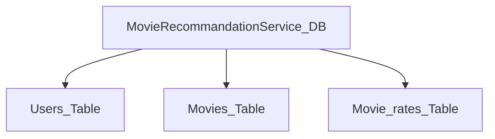

#  Database SQL 기초

구글 공유 드라이브에 자료 있으니 참고하자

##  DB

데이터베이스: 체계화된 데이터의 모임

여러 사람이 공유하고 사용할 목적으로 통합 관리되는 정보의 집합.

- 만들고create
- 읽고read
- 수정하고update
- 삭제하고delete

-> crud operation


### RDBMS 

- 관계형데이터베이스 관리 시스템

- 관계형 모델을 기반으로 하는 데이터베이스 관리 프로그램이다

- ex) MySQL, SQLite, PostgreSQL 등의 오픈소스

- ex) ORACLE, MS SQL (유료)

- RDB(관계형 데이터베이스)의 쉬운 예? 엑셀파일, 엑셀의 table 형태. 

###  SQLite

- 서버가 아니라 응용프로그램에 넣어 사용
- 비교적 가벼운 DB
- 로컬에서 간단한 DB구성 가능,
- 오픈소스 프로젝트라서 자유롭게 사용 가능

- 우리가 배울 프로그램. 


* c9 terminal에서 `sqlite3`하면 실행된다 `.exit`으로 나온다. 


###  스키마 (scheme)

- 청사진

- 데이터베이스 자료의 구조, 표현방법, 관계 등을 정의한 구조 

- 테이블(Table), 열(Column), 행(row), 레코드(record), PK(기본 키)


| column | datatype |
| ------ | -------- |
| id     | INT      |
| age    | INT      |
| phone  | TEXT     |
| email  | TEXT     |

- Column : 각 열에는 고융한 데이터타입이 지정된다. 
- Row : 행에는 테이블의 데이터가 저장된다. (4명의 고객정보가 저장되었다면 = 4개 행 존재)
- PK (Primary Key): 각 행(레코드)의 고유값. 반드시 설정해야 하며, DB관리 및 관계 설정시 주요활용


##  SQL 개념 

- Structured Query Language
- RDBMS의 데이터를 관리하기 위해 설계된 특수 목적의 프로그래밍 언어
- RDBMS에서 자료의 검색, 관리, DB스키마 생성,수정 , DB 객체 접근 조정 관리를 위해 고안 됨 

###  1. SQL문법

- DDL 데이터 정의 언어
- DML 데이터 조작 언어
- DCL 데이터 제어 언어

 -> 자세히 배우진 않는다. 활용도가 높은 것들 위주로 배울 예정. 


###  2. Hello, DB! 

**데이터 가져오기(c9기준)**

1. db.csv 파일을 가져다 디렉토리에 넣기 (구글 공유폴더에 파일 있음)
2. 터미널실행 - `sqlite3` - `.mode csv`
3. `.import hellodb.csv hellodb`  디비.csv 파일을 가져와서 hellodb라는 시트를 만들겠다. 
4. `.tables` 테이블을 다 보여줘  
5. `SELECT*FROM hellodb;` 테이블로부터 다("*")선택해서 가져와줘 

   `SELECT last_name,first_name FROM hellodb;` 테이블에서 last_name이랑 first_name 가져와줘

   **SELECT는 데이터베이스에서 특정값을 반환한다.**

6. `.mode column` 칼럼별로 공간을 줘

7. `.headers on` 헤더를 다 보여줘 

   ```ter
   sqlite> .mode column
   sqlite> .headers on
   sqlite> SELECT*FROM hellodb;
   
   id          first_name  last_name   age         country     phone        
   ----------  ----------  ----------  ----------  ----------  -------------
   1           길동      홍         600         충청도   010-2424-1232
   ```

**정리 **

- terminal 에서 `sqlite3`  로 SQL 실행  

- CSV파일을 가져와서 database로 만들고 조회

  ```terminal
  sqlite> .mode csv
  sqlite> .import 파일명.csv 테이블명
  sqlite> SELECT*FROM 테이블명;
  1,'길동','홍',600,'충청도',010-1122-3344
  ```

- 테이블 예쁘게 보기 

  ```terminal
  sqlite> .headers on
  sqlite> .mode column
  sqlite> SELECT*FROM 테이블명;
  ```


### 3. DB, Table 생성

**3-1 . database 생성**

```terminal
$ sqlite3 tutorial.sqlite3
sqlite> .databases
```

**3-2. Table 생성**

```terminal
sqlite> CREATE TABLE classmates(
id INT PRIMARY KEY, 
name TEXT);
```

**3-3. Table과 Database의 관계** 



1. Datatype 

   - SQLite는 동적 데이터 타입으로, 기본적으로 affinity에 맞게 들어간다. 

     | Affinity | -                                            |
     | -------- | -------------------------------------------- |
     | INTEGER  | TINYINT, SAMLLINT, MEDIUMINT, INT, BIGINT... |
     | TEXT     | CHARACTER, VARCHAR, TEXT                     |
     | REAL     | REAL, DOUBLE, FLOAT                          |
     | NUMERIC  | NUMERIC, ECIMAL, DATE, DATETIME              |
     | BLOB     | ( no datatype specified )                    |
     | BOOLEAN  | 0,1                                          |

2. Table 및 schema 조회 

   - `.tables` : 테이블 목록 조회
   - ` .schema tablename` : 특정 테이블 스키마 조회

3. Table삭제 (DROP)

   - ` DROP TABLE tablename;` 

   - `.tables`

   - > 아래와 같은 스키마를 가지고 있는 classmate 테이블 만들기 
     >
     > | column  | datatype |
     > | ------- | -------- |
     > | id      | INT      |
     > | name    | TEXT     |
     > | age     | INT      |
     > | address | TEXT     |

     ```terminal
     aqlite> CREATE TABLE classmates(
     id INT PRIMARY KEY,
     name TEXT,
     age INT,
     address TEXT); 
     ```

     

###  4. 쉽게 명령 편집하기 

1. 터미널에서 실수했다면? ctrl +D 하던거 취소하고 나오기 

   한번 실수하면 계속 취소 해야 하니, 전체 명령어를 써서 불러오자. 

2. create_table.sql 파일 생성 - 명령어 전체 입력, 저장 

   ```sql
   CREATE TABLE classmate (
       id INTEGER PRIMARY KEY,
       name TEXT,
       age INTEGER
   );
   ```

   `sqlite3 tutoral.sqlite3` 'tutoral.sqlite3'라는 sqlite3파일을 (만들어)실행하겠다 

   -`.read create_table.sql` 명령어가 든 sql 파일을 읽어오겠다

   -`.tables` 현재 sqlite3파일에 들어있는 테이블들을 조회하겠다

3. 좀더 가보자!!!

   ```sql
   CREATE TABLE classmates (
       id INTEGER PRIMARY KEY AUTOINCREMENT,
       name TEXT,
       age INTEGER NOT NULL,
       adress TEXT IS NULL
   );
   ```

   `id INTEGER PRIMARY KEY AUTOINCREMENT`: primary key인 id는 자동으로 상승하며 생성

   `age INTEGER NOT NULL`:  age에는 반드시 인티져값이 들어가야한다. 비면 안됨.

   `adress TEXT IS NULL`:  adress에는 값이 비어있어도 괜찮다. 

### 5. 데이터 추가, 읽기, 수정, 삭제

####  5-1. data 추가 (insert)

1. 특정 table에 새로운 행을 추가하여 데이터를 추가할 수 있습니다. 

   ``` sqlite
    ALTER TABLE classmate
    ADD COLUMN twitter_handle TEXT;
   ```

   ``` sqlite
   sqlite> INSERT INTO 테이블이름(name,age)
   ...> VALUES('김길동',23);
   ```

   - `ALTER TABLE` is a clause that lets you make the specified changes. 
   - `ADD COLUMN` is a clause that lets you add a new column to a table: 
   - `twitter_handle` is the name of the new column being added

2. 기존 행에 데이터를 추가할 수 있습니다.

   ```terminal
    INSERT INTO celebs (id, name, age)
    VALUES (1,'Justin Bieber', 22);
   ```

   ```
   INSERT INTO celebs VALUES (1,'Justin Bieber', 22,'@justbieb');
   ```

- 모든 열에 데이터를 넣을 때에는 column을 명시할 필요가 없다.

  ```terminal
  sqlite> INSERT INTO 테이블이름 VALUES('박길동','29','서울')
  ```

- 꼭 필요한 정보라면 공백으로 비워두면 안된다, 

- id 는 Primary Key이므로 반드시 필요하고, 값이 저장되면 자동으로 증가하도록한다(unique)

- Table 설정 변경 

  ```terminal
  sqlite> DROP TABLE 테이블이름;
  sqlite> CREATE TABLE 테이블이름(
  id INTEGER PRIMARY KEY AUTOINCREMENT,
  name TEXT NOT NULL,
  age INT NOT NULL,
  address TEXT NOT NULL); 
  ```

  - ★ AUTOINCREMENT는 INTEGER에만 사용가능합니다. 

####  5-2. Data 가져오기 (SELECT)

- `SELECT * FROM 테이블이름`
- ` SELECT 열1, 열2 FROM 테이블이름` 
- ` SELECT id, name FROM 테이블이름 LIMIT 10 ` : 10개만 가져오기
- `SELECT 열1, 열2 FROM 테이블이름 LIMIT 1 OFFSET 3` : 세번째 부터 하나 가져오기
- ` WHERE column = value ;` : column값이 value인 값 가져오기


####  5-3. data 수정 (update)

1. 특정 행 특정 열의 데이터를 수정할 수 있습니다.

   ``` terminal
    UPDATE celebs
    SET twitter_handle = '@taylorswift13'
    WHERE id = 4;
   ```

   - `UPDATE` is a clause that edits a row in the table. 
   - `celebs` is the name of the table. 
   - `SET` is a clause that indicates the column to edit.

- `UPDATE 테이블이름 SET 열1= 값1 , 열2=값2 .. WHERE 조건 ` : 특정 테이블에 특정 레코드 수정 가능
- ` UPDATE friends SET 이름=황길동, 주소=제주시 WHERE id=10;` 


#### 5-4. data 삭제 (delete)

1. 특정 열을 조건에 맞춰 삭제할 수 있습니다.

   ```terminal
    DELETE FROM celebs
    WHERE twitter_handle IS NULL;
    SELECT *FROM celebs;
   ```

   - `DELETE FROM` is a clause that lets you delete rows from a table.
   - `celebs` is the name of the table we want to delete rows from.
   - `WHERE` is a clause that lets you select which rows you want to delete. Here we want to delete all of the rows where the twitter_handle column `IS NULL`.
   - `IS NULL` is a condition in SQL that returns true when the value is `NULL` and false otherwise.

2. 보통 유니크 식별자인 id로 삭제한다 : 이름으로 지울결우 동명이인의 가능성 있으므로 

   ``` DELETE FROM classmates
   DELETE FROM classmates
      ...> WHERE id = 2;
   ```

3.  삭제된 id 포함하여 누적된다  ; 123 중 2를 삭제하고 새로 작성했다면 134.. 로 누적

   ```
   sqlite> INSERT INTO classmates (name, age, adress) VALUES ('손지명',30,'서울');
   sqlite> SELECT * FROM classmates;
   ```

   ```
   SELECT * FROM classmates;
   id          name        age         adress    
   ----------  ----------  ----------  ----------
   1           강동주   34          서울    
   3           권혁주   29          강릉    
   4           손지명   30          서울 
   ```

**정리**

- `DELETE FROM 테이블이름 WHERE 조건 `  : 특정 레코드를 테이블에서 삭제할 수 있다.
- `DELETE FROM 테이블이름 WHERE id= 3` : 보통 중복 불가능한(unique한) id 를 기준으로 지운다. 
- id 가 3인 레코드를 지우면? 아이디가 1,2,4 .. 인 레코드가 남는다. id가 재정렬되지 않는다. 


| -    | 구문   | 예시                                                         |
| ---- | ------ | ------------------------------------------------------------ |
| C    | INSERT | INSERT INTO friends(name, age, address) VALUES('홍길동','30','서울'); |
| R    | SELECT | SELECT * FROM friends WHERE id = 1;                          |
| U    | UPDATE | UPDATE friends SET name='홀길돌', WHERE id =1 ;              |
| D    | DELETE | DELETE FROM friends WHERE id=1;                              |


### 6. WHERE, expression

#### 6-1. where 심화

- ` SELECT * FROM 테이블이름 WHERE 조건` : 특정 테이블에서 특정 조건의 Column만 가져오기 

- > 예제 1. users 테이블에서 age가 30 이상인 사람만 가져오려면? 
  >
  > 예제 2. users 에서 age가 30 이상인 사람의 이름만 가져오려면?
  >
  > 예제 3. users 에서 age가 30 이상이고 이름이 길동인 사람의 나이와 주소를 가져오려면? 

  예제 1 : ` SELECT * FROM users WHERE age >= 30;` 

  예제 2 : ` SELECT name users WHERE age >= 30;` 

  예제 3: `SELECT age,adress WHERE age >= 30 and name='길동'` 

  

- `SELECT * FROM classmates WHERE name = '강동주';`

  `SELECT * FROM classmates WHERE id is 3;`

  `SELECT id,name FROM classmates WHERE adress = '서울';  `

- is 보다 = 를 쓰는 것이 더 공식적이다. ==도 가능하다. 참고


#### 6-2. Expression

- ` SELECT COUNT(열) FROM 테이블이름` : 레코드의 갯수를 반환한다. 

- ` SELECT COUNT(*) FROM friends` : friends 테이블의 레코드 총 갯수 

- ` SELECT AVG(열) FROM 테이블이름 ` : 열 레코드가 숫자일 때만 가능하다 . 

- ` AVG()` , `SUM()` , `MIN()` , `MAX()` 

- > 예제 1.  bank 테이블에서 balance가 가장 큰 사람의 이름과 잔액   
  >
  > 예제 2. bank 테이블에서 30세 이상인 사람의 평균 계좌 잔액은? 

  틀림 !!!??  ` SELECT balance, name FROM bank WHERE MAX(balance)` 

  예제 1 : ` SELECT MAX(balance), name FROM bank ` : bank에서 balance가 가장 큰 사람의 이름과 잔액   

  예제 2 :` SELECT AVG(balance) FROM bank WHERE age >= 30; `  

  

#### 6-3. LIKE

- `SELECT * FROM WHERE age LIKE'2%'; ` : 정확한 비교가 아닌, 패턴을 확인하여 해당 값 반환 

  | -    | -       | -                                    |
  | ---- | ------- | ------------------------------------ |
  | %    | 2%      | 2로 시작하는 값                      |
  |      | %2      | 2로 끝나는 값                        |
  |      | %2%     | 2가 들어가는 값                      |
  | _    | _2%     | 아무값 다음 두번째가 2로 시작하는 값 |
  |      | 1___    | 1로 시작하고 네자리인 값             |
  |      | `2_%_%` | 2로 시작하고 적어도 3자리인 값       |

### 6. 정렬(order) 

- `SELECT 출력하고자하는열 FROM 테이블이름 ORDER BY 정렬하고자하는열 ASC/DESC ` 

- > 예제 1. users에서 나이순으로 오름차순 정렬하여 상위 10개만 뽑으려면?
  >
  > 예제 2. users에서 나이순, 성 순으로 오름차순 정렬하여 상위 10개만 뽑으려면?
  >
  > 예제 3. users에서 계좌잔액순으로 내림차순 정렬하여 해당하는 사람이름 10개만 뽑으려면? 

  예제1. ` SELECT * FROM users ORDER BY age ASC LIMIT 10;` 

  예제2. `SELECT * FROM users ORDER BY age, last_name ASC LIMIT 10;` 

  예제3. `SELECT first_name,last_name FROM users ORDER BY balance DESC LIMIT 10; ` 

  

1. 우선 테이블 전체를 보자 

   ```
   SELECT *FROM classmates;     
   id          name        age         adress    
   ----------  ----------  ----------  ----------
   1           강동주   34          서울    
   2           정수원   28          부천    
   3           권혁주   29          강릉       
   ```

2. `SELECT id, name, age FROM classmates LIMIT 2;` : 2개까지만 보겠다

   ```
   id          name        age       
   ----------  ----------  ----------
   1           강동주   34        
   2           정수원   28 
   ```

3. `SELECT id, name, age FROM classmates LIMIT 1 OFFSET 1;` : 1개 건너띄고 1개만 보겠다

   ```
   id          name        age       
   ----------  ----------  ----------
   2           정수원   28   
   ```

   ex) 게시판에서 게시물을 한페이지에 50개씩만 보도록 LIMIT을 걸고, 특정 페이지를 보고자 하면 앞 페이지를 건너띄고 조회하는 OFFSET*페이지 를 걸 수 있다. : 페이지네이션 


**new table ; Constraints**

1. 새로운 테이블을 한번에 생성해 봅시다.

   Create a new table with constraints on the values.

   ``` terminal
   CREATE TABLE awards (
    	id INTEGER PRIMARY KEY,
    	recipient TEXT not NULL,
   	award_name TEXT DEFAULT 'Grammy'
   );
   ```

   ``` terminal
   CREATE TABLE celebs (
      id INTEGER PRIMARY KEY, 
      name TEXT UNIQUE,
      date_of_birth TEXT NOT NULL,
      date_of_death TEXT DEFAULT 'Not Applicable'
   );
   ```

   - `PRIMARY KEY` columns can be used to uniquely identify the row. Attempts to insert a row with an identical value to a row already in the table will result in a *constraint violation* which will not allow you to insert the new row.
   -  `UNIQUE` columns have a different value for every row. This is similar to `PRIMARY KEY` except a table can have many different `UNIQUE` columns.
   -  `NOT NULL` columns must have a value. Attempts to insert a row without a value for a `NOT NULL` column will result in a constraint violation and the new row will not be inserted.
   -  `DEFAULT` columns take an additional argument that will be the assumed value for an inserted row if the new row does not specify a value for that column.

###  데이터 선택적으로 조회하기

  **1.  LIMIT 과 OFFSET**

1. 우선 테이블 전체를 보자 

   ``` 
   SELECT *FROM classmates;     
   id          name        age         adress    
   ----------  ----------  ----------  ----------
   1           강동주   34          서울    
   2           정수원   28          부천    
   3           권혁주   29          강릉       
   ```

2. `SELECT id, name, age FROM classmates LIMIT 2;` : 2개까지만 보겠다

   ```
   id          name        age       
   ----------  ----------  ----------
   1           강동주   34        
   2           정수원   28 
   ```

3. `SELECT id, name, age FROM classmates LIMIT 1 OFFSET 1;` : 1개 건너띄고 1개만 보겠다

   ```
   id          name        age       
   ----------  ----------  ----------
   2           정수원   28   
   ```

   ex) 게시판에서 게시물을 한페이지에 50개씩만 보도록 LIMIT을 걸고, 특정 페이지를 보고자 하면 앞 페이지를 건너띄고 조회하는 OFFSET*페이지 를 걸 수 있다. : 페이지네이션 

**2. WHERE**

1. `SELECT * FROM classmates WHERE name = '강동주';`

   `SELECT * FROM classmates WHERE id is 3;`

   `SELECT id,name FROM classmates WHERE adress = '서울';  `

2. is 보다 = 를 쓰는 것이 더 공식적이다. ==도 가능하다. 참고


### 더 해보기 

1. users.csv 데이터베이스를 가져와라 

   ```
   sqlite> .mode csv
   sqlite> .import users.csv users
   sqlite> .tables
   classmates  users 
   ```

2. 카운트해줘라, 모든 개수를, users의?

   ```
   sqlite> SELECT COUNT(*) FROM users;
   COUNT(*)
   1000
   ```

3. 카운드해줘라, 모든 개수를,  user의, 나이가 30세 이상인? 

   ```
   sqlite> SELECT COUNT(*) FROM users WHERE age >30;          
   COUNT(*)
   386
   ```

4. 가져와라, 모든 user의 나이가 30세 이상인 데이터들을

   ```
   sqlite> SELECT * FROM users WHERE age >30;
   id,first_name,last_name,age,country,phone,balance
   1,"정호","유",40,"전라북도",016-7280-2855,370
   2,"경희","이",36,"경상남도",011-9854-5133,5900
   3,"정자","구",37,"전라남도",011-4177-8170,3100
   4,"미경","장",40,"충청남도",011-9079-4419,250000
   ...
   ...
   ... 
   ```

5. 성과 이름을 가져와라, user에서 나이가 30세 이상인 데이터들을  

   ```
   sqlite> SELECT last_name,first_name FROM users WHERE age >30;
   last_name,first_name
   "유","정호"
   "이","경희"
   "구","정자"
   "장","미경"
   ...
   ```

6. 데이터베이스에서 나이가 30이상이고 성이 '정'인 데이터의 성과 나이를 가져와라 

   ```
   sqlite> SELECT last_name, age FROM users WHERE age > 30 AND last_name = '정';
   last_name,age
   "정",38
   ```

7. 데이터베이스에서 발란스가 가장 큰 사람의 성과 이름을 가져와라 (성과 이름과 가장 큰 발란스값을 가져와라) 

   ```
   sqlite> SELECT first_name, last_name, MAX(balance) FROM users;
   first_name,last_name,MAX(balance)
   "선영","김",990000
   ```

8. 30세 이상인 데이터들의 발란스 평균을 가져와라 

   ```
   sqlite> SELECT AVG(balance) FROM users WHERE age>30;
   AVG(balance)
   154958.704663212
   ```

9. 선X  

   ```
   sqlite> SELECT * FROM users WHERE first_name LIKE "선%";
   id,first_name,last_name,age,country,phone,balance
   42,"선영","이",37,"충청북도",011-8272-1305,570000
   101,"선영","손",35,"경상북도",010-6837-7763,230
   ```

   | 2%   | 2로 시작하는 값 |
   | ---- | --------------- |
   |      |                 |

10.  나이 어린사람부터(오름차순 정렬하여, ASC) 30명의 모든데이터

    ```
    sqlite> SELECT *FROM users ORDER BY age ASC LIMIT 30;
    id,first_name,last_name,age,country,phone,balance
    11,"서영","김",15,"제주특별자치도",016-3046-9822,640000
    59,"지후","엄",15,"경상북도",02-6714-5416,16000
    ```

11.  나이 많은 사람부터 (내림차순 정렬, DESC) 20명의 모든데이터

    ```
    sqlite> SELECT *FROM users ORDER BY age DESC LIMIT 20;                                             
    id,first_name,last_name,age,country,phone,balance
    1,"정호","유",40,"전라북도",016-7280-2855,370
    4,"미경","장",40,"충청남도",011-9079-4419,250000
    28,"성현","박",40,"경상남도",011-2884-6546,580000
    53,"상훈","홍",40,"전라북도",016-7698-6684,550
    ```

12. ```
    sqlite> SELECT *FROM users ORDER BY age, last_name ASC LIMIT 10;                                  
    id,first_name,last_name,age,country,phone,balance
    295,"정수","강",15,"충청북도",02-7245-5623,500
    61,"우진","고",15,"경상북도",011-3124-1126,300
    998,"시우","고",15,"제주특별자치도",016-3732-8726,270
    ```


